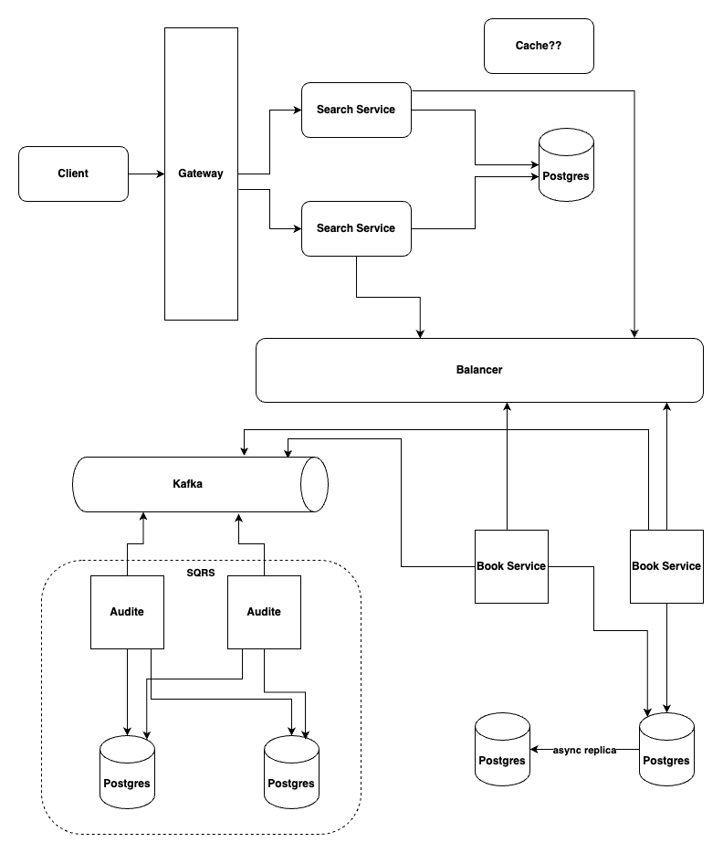

# microservices-project
## Задача на микросервисы

### Цель
Научиться строить микросервисные системы целиком и настраивать самостоятельно. Отрезаем от этой ветки свои и в конце делаем МР для ревью. МР удаляем.

#### Путь
Нужно будет решить две задачи. Первая, основана на Spring Cloud. Вторая, на ks8 подходе.

#### Разбираемся с паттернами
Паттерны интеграции микросервисов

Интеграция микросервисов - это ключевой аспект успешной архитектуры микросервисов. Существует несколько паттернов интеграции микросервисов, которые помогают обеспечить эффективное взаимодействие между сервисами. 

Вот несколько распространенных паттернов:
1. Синхронная коммуникация (HTTP/REST API) 
 Каждый микросервис предоставляет HTTP API для взаимодействия с другими сервисами. Простота в реализации и отладке. Но это может привести к повышенной зависимости между сервисами и увеличению времени ответа.
2. Асинхронная коммуникация (Message Queues)
 Использование очередей сообщений (например, RabbitMQ, Kafka) для асинхронной передачи сообщений между микросервисами. Обеспечивает более низкую связанность, но может быть сложным в отладке и поддержке
3. Группировка API (API Gateway)
 Введение API-шлюза, который предоставляет единый точку входа для всех запросов к микросервисам. Упрощает клиентскую сторону, но может создавать единую точку отказа.
4. Централизованное управление конфигурацией (Centralized Configuration)
 Хранение настроек конфигурации в централизованном репозитории, чтобы облегчить изменение конфигурации микросервисов без их перезапуска. Обеспечивает гибкость в управлении конфигурацией.
5. Обнаружение сервисов (Service Discovery)
 Использование сервисов регистрации/обнаружения (например, Consul, Eureka), чтобы микросервисы могли находить друг друга динамически. Позволяет автоматически обнаруживать и подключать микросервисы в сети.
6. Транзакционная сага (Saga Pattern)
 Разделение бизнес-транзакции на серию шагов, которые выполняются различными микросервисами. Обеспечивает атомарность транзакций в распределенной среде.
7. Мониторинг и журналирование (Monitoring and Logging)
 Внедрение мониторинга и журналирования для отслеживания и анализа деятельности микросервисов. Помогает в выявлении проблем и улучшении производительности.
8. Шина событий (Event Bus)
 Использование шины событий (например, Apache Kafka, RabbitMQ) для передачи событий между микросервисами.Позволяет реагировать на события в реальном времени, но требует внимания к обработке событий и согласованности.
9. API-фасад (API Facade)
 Создание фасада над несколькими микросервисами для предоставления унифицированного интерфейса. Упрощает внешний интерфейс для клиентов, скрывая сложность внутренней структуры микросервисов.
10. Обратный прокси (Reverse Proxy)
 Использование обратного прокси (например, Nginx, HAProxy) для маршрутизации и балансировки нагрузки между микросервисами. Повышает масштабируемость и надежность.
11. Кеширование (Caching)
 Внедрение кеша для улучшения производительности и снижения нагрузки на микросервисы. Требует внимания к согласованности данных в кеше.
12. Композиция микросервисов (Micro Frontends)
 Разделение пользовательского интерфейса на небольшие, независимые фрагменты, которые разрабатываются и развертываются независимо. Облегчает масштабирование и обновление фронтенда.
13. Тестирование в изоляции (Isolation Testing)
 Тестирование микросервисов в изоляции от остальной части системы. Упрощает обнаружение и устранение ошибок, но требует управления зависимостями.
14. Обнаружение и восстановление (Circuit Breaker)
 Использование паттерна "отключения" для предотвращения распространения сбоев от одного микросервиса к другим. Повышает устойчивость системы к отказам.
15. Постоянные идентификаторы 
 Назначение постоянных идентификаторов для сущностей в распределенной системе для обеспечения единообразного идентификационного пространства.
16. Повторная попытка (Retry)
 Использование механизмов повторной попытки для автоматического повтора запросов, которые могли завершиться неудачно

#### Задача попроще 
Делаем простой набор микросервисов на Spring. Смотрим как это все между собой работает и запоминаем. 
Примеры можно найти много где, не буду здесь приводить чтобы отобрать радость исследования. 

Самое главное, чтобы после реализации в проекте были:
- API gateway - Spring Cloud Gateway	
- Centralized configuration -	Spring Cloud Config
- Distributed tracing - Spring Cloud Sleuth
- Declarative HTTP client - Spring Cloud OpenFeign
- Service discovery - Spring Cloud Netflix Eureka
- Circuit breaker - Spring Cloud Netflix Hystrix
- Client-side load balancing - Spring Cloud Netflix Ribbon

По желанию, конечно, можно добавлять сколь угодно компонентов.

#### Посложнее.
Мы попрактиковались в микросервисах, теперь делаем уже все по-взрослому.

##### Задача: 
У нас есть сервис бронирования апартаментов по России. Нужно сделать поиск по доступным датам и дать возможность бронировать. Соответственно, у сервиса должна быть регистрация/авторизация. 
 Поддерживаем отказоустойчивость и все то что прочитали и узнали выше.



##### Небизнес требования:
- Выключаем основную базу - все работает
- Отключаем один сервис - работает
- Аутентификация отвалилась - все для чего не нужно авторизация работает
- и т.д.

##### Используемые технологии
- Minikube
- Docker
- Kafka
- Spring 
- Postgres
- Hibernate
- Java/Kotlin
- Аутентификаци, авторизация
- ELK/Prometheus, Grafana
- Балансировщик (nginx или любой на выбор)
- *Flutter
